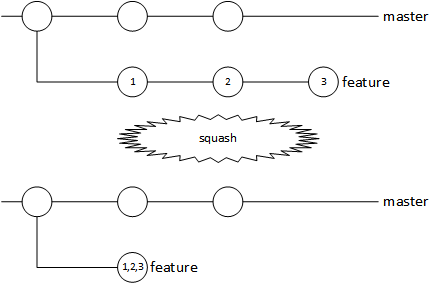

# Git Workflow

- [Starting Your Feature](./README.md#starting-your-fetaure--bug-fix)
  - [Create the Branch](./README.md#create-a-branch-named-after-your-feature--bug-fix)
  - [Preparing to Merge the Completed Feature](./README.md#preparing-your-feature--bug-fix-to-be-merged)
    - [Squash](./README.md#find-out-how-many-commits-you-have-on-your-branch)
    - [Rebase](./README.md#rebase-your-branch-against-master)
      - [Updating Master](./README.md#updating-master)
      - [The Rebase Command](./README.md#the-rebase-command)
    - [Update Remote](./README.md#push-the-changes-to-your-branch-to-the-remote-server-typically-origin)
- [The Reviewing Process](./README.md#the-review-and-merge-process)
  - [Pull Request isn't Immediately Accepted](./README.md#what-happens-if-your-pull-request-isnt-accepted-right-away)
- [Guidelines](./README.md#guidelines)

## Starting your fetaure / bug fix

### Create a branch named after your feature / bug fix


`git checkout -b name-of-your-feature-or-bug-fix`
This will create the branch and checkout that branch at the same time. This is the equivelant of:
```
git branch name-of-your-feature-or-bug-fix
git checkout name-of-you-feature-or-bug-fix
```

Now that you are in your own branch, you can make however many commits, with whatever commit messages you want, even frustrating messages about things not working and having no idea why. These will be edited later.

## Preparing your feature / bug fix to be merged
Before merging our branch to `master`, we'll want to clean up our feature / bug fix branch's commit history.

#### Find out how many commits you have on your branch.
`NUMCOMMITS=$(git rev-list --count HEAD ^master); echo $NUMCOMMITS`

#### Combine all the commits on your branch in to one.


`git rebase -i HEAD~$NUMCOMMITS`

A screen like the following will appear, and you'll want to change all the most recent commits to say `squash`.  
This:
```
pick edfec6c initial refactor to make way for easy feature adding
pick 8df52d5 refactored a bit more, and matched some method names to that of json_api
pick 4f2ad3e rename add_relationship methods to be less awkward
```
Should become:  
```
pick edfec6c initial refactor to make way for easy feature adding
squash 8df52d5 refactored a bit more, and matched some method names to that of json_api
squash 4f2ad3e rename add_relationship methods to be less awkward
```   
Note that the top line is the oldest commit on your branch, and the bottom commit is the most recent.

#### Edit the combined commit message.
You'll be faced with a screen that will look something like this:  
```
# This is a combination of 3 commits.
# The first commit's message is:
initial refactor to make way for easy feature adding
```
You can either add a line to the top of the pre-existing messages to summarize what all has been done, or it could all be deleted and you could write a message that concisely describes what your branch adds to the project.

#### Rebase your branch against master


This changes which commit your branch is *based* off of.  
First we'll want to update our local copy of `master`

##### Updating master

```
git checkout master
git fetch origin
git reset origin/master --hard
```
This will update your local repo with all branchs on the `origin` remote and *destroy any potential unpushed changes* you have on the `master` branch -- which is why it is very important that no modification should ever be done to the `master` branch.

To proceed, you'll want to switch back to your branch.  
`git checkout name-of-you-feature-or-bug-fix`

##### The Rebase Command

`git rebase master`

Now, it will look like all of your changes happened after the most recent commit on `master`. This makes `master`s history look clear and well organized.

#### Push the changes to your branch to the remote server
`git push origin name-of-you-feature-or-bug-fix -f`  
Note the `-f`. This means "force", as it will overwrite the history of your branch on the server. So it is very important to either have completed work on the branch, or be the only person working on the branch. In any case, only squash and force push when the branch is complete, and ready to be submitted for review.

## The Review and Merge Process


Once the branch is syncronized with the remote (e.g.: `origin`), a pull request for `name-of-you-feature-or-bug-fix` should be made against the `master` branch.

Reviewing pull requests is generally done in the web browser on whatever git service you are using (github, gitlab, etc) so that a conversation between reviewing and submitter can be recorded for others to see and provide input if they so choose.

Some general guidelines for reviewing code:
 - Pay attention to decisions made in the implementation, if something is unclear, there should be inline comments describing that decision, possible consequences if applicable, etc
 - Note code style - all code from all contributors should adhere to the same rules.
 - For small pull requests, (maybe < 100 additions/deletions) it could be ok to have only one person review, and merge to `master`.
 - For larger pull requests, (maybe > 100 additions/deletions and < 500 additions/deletions), there should be at least one additional reviewer. The majority of reviewers should sign off on the pull request before it is merged in to `master`.


### What happens if your pull request isn't accepted right away?

If a reviewer leaves actionable feedback, you'll have to make changes to your branch, and re-commit and re-push.
It's recommended to not re-squash until all reviewers are ok with your code, and there is nothing left to review. This to help track the history of the pull request and see how it changes over the review process.
Once re-squashed, the reviewers should check over everything to make sure nothing sneaky was added.

### Guidelines
 - No changes should be done directly on `master`  
 - `master` should only change via the merge of a pull request
 - Never force push to `master`

DSM